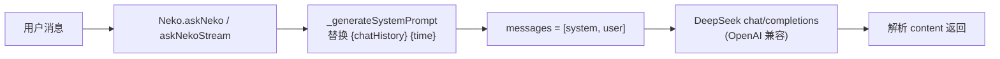
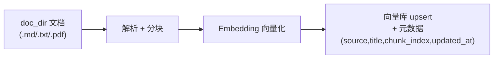
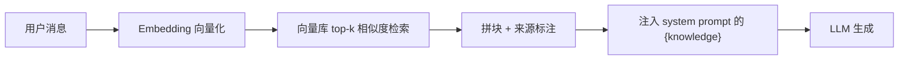
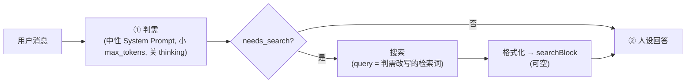
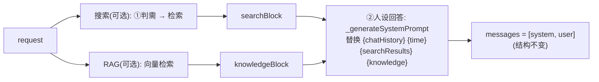

# core 模块增强设计：联网搜索与 RAG 知识库检索

> 状态：设计文档（**未实现**） · 范围：只做可行性论证与架构设计，不改代码、不加依赖。

## 1. 背景与结论

**结论：当前 `core` 模块具备加入「联网搜索」与「RAG 知识库检索」的干净扩展点，两者都可行。推荐以「背景信息注入」方式落地，并优先做 RAG 语义向量检索，联网搜索留作后续阶段。**

理由（详见后文）：

- `Neko._generateSystemPrompt` 已用占位符机制（`{chatHistory}`、`{time}`）注入动态上下文，`extraContext` 参数是现成的额外注入点（QQ 群上下文已用）。检索结果可复用同一机制。
- prompt 的 `context` 段已含「背景信息」小节（“涉及相关信息必须参考背景信息、严禁猜测”），天然适合承载检索结果，且不破坏猫娘人设。
- 消息结构为单轮 `[system, user]`，人设 firewall 禁止暴露 AI/工具身份 → **注入式（结果当背景）优于显式工具调用**。

## 2. 现状盘点

### 2.1 模块结构

- `core/neko.py` — `Neko` LLM 客户端：加载配置与人设、组装 system prompt、调用 provider、解析响应。
- `core/chatHistory.py` — `ChatHistory` SQLite 存储：`chatHistory`（用户维度）与 `groupChatHistory`（群维度）两张表，含损坏自愈与裁剪。
- `core/config/` — `config.yaml`（共享 LLM 配置）、`prompt_CN/EN.yaml`（分段人设）、`inf.yaml`（旧 provider URL）。
- `core/requirements.txt` — 仅 `aiohttp` / `loguru` / `PyYAML`。

### 2.2 数据流



### 2.3 扩展点

1. **`extraContext` 参数**：QQ 已用它注入群聊上下文，检索结果可同路径注入。
2. **占位符机制**：`_generateSystemPrompt` 现替换 `{chatHistory}`/`{time}`；可新增 `{searchResults}`、`{knowledge}` 占位符。
3. **prompt「背景信息」小节**：已有“参考背景信息、严禁猜测”的语义，检索结果归入此处最自然。

### 2.4 关键约束

| 约束 | 影响 |
|---|---|
| DeepSeek 无 embeddings 端点 | 语义 RAG 必须另找 embedding 来源（本地模型或 OpenAI 兼容 API） |
| 单轮 `[system, user]` 消息结构 | agentic 工具调用需重构为多轮消息 + 工具循环 |
| 人设 firewall 禁止暴露 AI/工具 | 检索结果必须以“背景信息”呈现，禁止模型自报检索动作 |
| 依赖极简 | 新能力需评估新增依赖的重量 |
| SQLite 3.53.4 已带 FTS5 | 后续做混合检索可零依赖复用 |

## 3. RAG 设计（语义向量检索，方向已定）

### 3.1 总体管线

**索引（离线/后台）**：



**检索（在线，命中时）**：



### 3.2 Embedding 来源（已定：本地 fastembed / BGE）

| 选项 | 优点 | 缺点 | 结论 |
|---|---|---|---|
| 本地 `fastembed`（BGE-small-zh-v1.5 / bge-m3） | 离线、无 key、CPU 可跑、多语言 | 首次下载模型、占内存 | ✅ 已定 |
| `sentence-transformers`（torch） | 模型生态全、可微调 | 依赖 torch，较重 | 备选 |
| OpenAI 兼容 embedding API | 质量高、免本地算力 | 需 key/网络；DeepSeek 无此端点 | 备选（有 key 时） |

> 已定 `fastembed`：ONNX 推理、CPU 友好，契合“个人猫娘 bot、零 key、离线”的定位。

### 3.3 向量库选型（已定：chromadb）

| 选项 | 优点 | 缺点 | 结论 |
|---|---|---|---|
| `chromadb` | 嵌入式持久化、API 简单、生态成熟 | 依赖稍重 | ✅ 已定 |
| `lancedb` | 文件式、轻量、无服务、快 | 生态较新 | 备选（更轻） |
| `sqlite-vec` | 复用现有 SQLite 生态、单文件 | 需加载扩展、生态较新 | 备选（统一存储） |

### 3.4 分块策略

- 按标题层级 + 段落切分；块长约 500–1000 字符（中文按字符计）。
- 预留 10–20% 重叠窗口，避免语义被切断。
- 每块保留元数据：`source`（文件路径）、`title`、`chunk_index`、`updated_at`。
- 增量：按文件 `mtime` 判断重索引，避免全量重复计算。

### 3.5 召回与注入

- `top_k` 默认 3，可配置。
- 注入时带来源标题（本地文档可能无 URL）。
- 注入到 system prompt 的「背景信息」小节（`{knowledge}` 占位符），并指示模型：**参考但不强行引用；不透露“查了知识库 / 做了检索”**。

## 4. 联网搜索设计（已定：两段式 LLM 判需 + 背景注入）

采用「两段式」：第一次用中性路由 System Prompt 让 LLM 判断该问题是否需要联网搜索；需要则搜索、把结果填进 `{searchResults}`；第二次用 Neko 人设 System Prompt 生成回答。仍保持单轮 `[system, user]` 结构，不是 agentic 工具调用。

### 4.1 两段式流程



### 4.2 判需 System Prompt 与输出契约

判需用**中性**提示词（不含猫娘人设、不面向用户），只输出 JSON：

```text
你是查询路由助手。判断用户消息是否需要联网搜索才能可靠回答。
- 需要搜索：涉及实时/最新信息、新闻、事实查证、天气、价格、日期、特定数据等，且仅凭已有知识无法可靠回答。
- 不需要搜索：闲聊、情感倾诉、角色扮演、主观看法、明确基于已有知识的问题。
只输出 JSON，格式：{"needs_search": true|false, "query": "改写后的检索词（仅 needs_search=true 时给出）"}
```

输出契约：`needs_search` (bool)、`query` (str)。

### 4.3 判需参数与查询改写

- 模型：与回答同模型，不新增第二套模型配置。
- `max_tokens` ≈ 128；关闭 thinking / 不传 `reasoning_effort`（避免判需长推理）。
- provider 支持则用 `response_format: {"type":"json_object"}`；否则靠提示词 + 容错解析（`json.loads` + 正则兜底）。
- 搜索用判需输出的 `query`，而非用户原话（例：「帮我看看上海今天冷不冷」→ query「上海 今日天气」）。

### 4.4 注入点

第二次请求走 `Neko.askNeko` / `askNekoStream` 现有路径；`_generateSystemPrompt` 多替换一个 `{searchResults}` 占位符（与 `{chatHistory}`/`{time}` 同机制）。人设 prompt 的「背景信息」小节指示模型：参考检索结果回答、但不透露“搜了网”。

### 4.5 流式与延迟

判需 + 搜索在流式开始前完成，首 token 会多一段延迟；可加「正在查一下…」占位（Telegram 已有 streaming draft 机制，QQ 可静默）。

### 4.6 代价对比

| 方案 | 额外 LLM 调用 | 准确性 | 结构改动 |
|---|---|---|---|
| 关键词触发 | 0 | 易误判/漏判 | 无 |
| 两段式判需（已定） | +1 次小调用/条 | 高 | 无 |
| Agentic 工具调用 | 多轮、更高 | 最高 | 需重构消息 + 工具循环 |

### 4.7 失败降级

- 判需调用失败 / JSON 解析失败 / `query` 为空 → 按「不需要搜索」处理，直接进第二段。
- 搜索失败 / 超时 / 无结果 → `searchBlock` 为空，照常回答。
- 绝不因搜索路径失败阻断人设回答。

### 4.8 搜索供应商（已定：SearXNG 公用实例）

采用 SearXNG 的公用实例（暂不自建），走其 JSON API：

- 请求：GET `{instance_url}/search?q={query}&format=json&language=zh-CN`（`language`/`safesearch`/`time_range` 可选）。
- 响应：`{"results": [{"title", "url", "content", "engine", ...}, ...]}`，取 `title`/`url`/`content` 作为结果。
- 实例地址可配置（示例 `https://searx.be`）；公用实例为第三方维护，可能限流或停用 JSON（见 searx.space 的 json 列），故 `instance_url` 做成可配置项，必要时换实例或后续再自建。

## 5. 配置草案

在 `llm` 下新增可选 `enhance` 段（**缺失即全部禁用**，向后兼容）：

```yaml
llm:
  # ... 现有字段不变 ...
  enhance:
    search:
      enabled: false
      provider: searxng             # 已定：SearXNG
      instance_url: https://searx.be # SearXNG 公用实例（可换）
      language: zh-CN               # 检索语言（可选）
      max_results: 3
      timeout_seconds: 10
      judge:
        max_tokens: 128             # 判需调用输出上限（越小越快）
    rag:
      enabled: false
      embedding_provider: fastembed  # fastembed | sentence_transformers | openai
      embedding_model: BAAI/bge-small-zh-v1.5
      store: chromadb                # chromadb | lancedb | sqlite-vec
      doc_dir: "./core/knowledge"
      top_k: 3
      chunk_size: 800
      chunk_overlap: 100
      db_path: ""                    # 留空默认 core/database/rag_store
```

## 6. 数据流变化（仅启用时）



新增模块建议：

- `core/knowledge.py` — 语义知识库（embedding + 向量库 + 检索）。
- `core/search.py` — 搜索供应商抽象（`SearchProvider` 协议 + provider 工厂），不依赖 LLM。
- `core/enhancer.py` — `SearchEnhancer` 编排：接收 judgeFn 回调 + 搜索供应商，做判需→检索→格式化；不 import Neko（避免循环依赖）。
- `core/neko.py` — 新增 `_judgeNeedsSearch(request)`：用中性 System Prompt 做判需调用，供 enhancer 注入。

## 7. 边界与失败模式

- **embedding/向量库初始化失败** → 禁用 RAG，log warning，纯 LLM。
- **搜索/embedding 超时或断网** → 返回空块，log warning，照常回答。
- **判需调用失败 / JSON 解析失败 / query 为空** → 按「不需要搜索」处理，直接进人设回答。
- **检索无结果** → 省略对应块。
- **检索结果过长** → 逐条 + 整块截断，避免撑爆 prompt / max_tokens。
- **中文分词** → embedding 模型天然支持中文；若未来走 FTS5 混合则用 `trigram` tokenizer。
- **人设防火墙** → 结果以“背景信息”呈现，prompt 明确禁止模型自报“我搜了网 / 查了库”。
- **向后兼容** → `config.yaml` 无 `enhance` 段时全部禁用；现有调用签名不变。

## 8. 分阶段路线图

| 阶段 | 内容 | 依赖 |
|---|---|---|
| Phase 0（本次） | 本设计文档 | 无 |
| Phase 1 | RAG 语义检索：`knowledge.py` + `enhancer.py` + `neko.py` 占位符注入 + 配置 + 测试 | fastembed + chromadb（已定） |
| Phase 2 | 联网搜索（两段式）：`search.py` + `_judgeNeedsSearch` + `{searchResults}` 注入 | 供应商已定（SearXNG 公用实例） |
| Phase 3 | 混合检索（向量 + FTS5 关键词），可选 Agentic 工具化 | Phase 1/2 |

## 9. 决策清单（已全部敲定）

| # | 问题 | 候选 | 结论 | 影响 |
|---|---|---|---|---|
| 1 | 联网搜索实现方式 | ~~待决~~ 已定：两段式 LLM 判需 + 背景注入 | 两段式 | 无需重构消息结构 |
| 2 | 搜索供应商 | ~~待决~~ 已定：SearXNG 公用实例 | SearXNG | 走 JSON API，实例可配置 |
| 3 | embedding 来源 | ~~待决~~ 已定：本地 fastembed（BGE） | fastembed | 离线、无 key、CPU |
| 4 | 向量库 | ~~待决~~ 已定：chromadb | chromadb | 嵌入式持久化 |

> 四项决策均已定（两段式判需 / SearXNG 公用实例 / fastembed / chromadb），可按第 5–7 节草案直接进入 Phase 1 实现。
